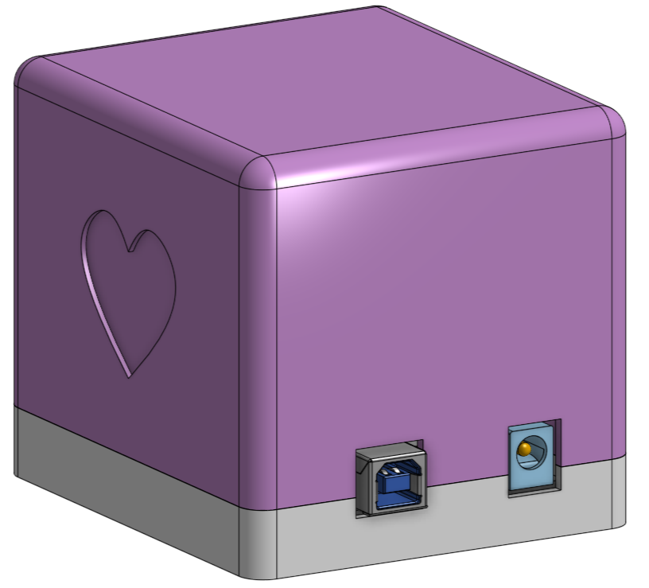
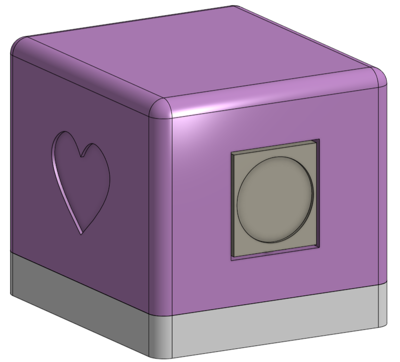

# Mother's Day Music Box 🎵 🎁 👩‍👦‍👦

A sweet (and a little cheesy) DIY project for Mother's Day! This interactive music box plays personalized audio messages from me and my brother using an Arduino Uno and DFPlayer Mini, all wrapped up in a cute 3D printed case.

## Finished Project

  <table>
    <tr>
      <td></td>
      <td></td>
    </tr>
    <tr>
      <td align="center"><i>Front view</i></td>
      <td align="center"><i>Back view</i></td>
    </tr>
  </table>

## What is this?
This is a homemade Mother's Day gift that plays recorded personal messages from loved ones. When turned on, it plays a startup sound followed by messages from me and my brother in sequence. The state machine can be easily updated though.

## How it works
1. The Arduino controls a DFPlayer Mini module that plays MP3 files from an SD card
2. A simple state machine cycles through different audio clips
3. Everything is housed in a 3D printed enclosure
4. Power comes from a standard USB connection to the Arduino (didn't had the time to implement a battery pack unfortunately)

## Project Structure
- `/audio` - Contains the MP3 files (not included in the repo for privacy)
- `/circuit` - Circuit diagram showing how everything is connected (also includes buttons in case you want to extend functionality)
- `/include` - Header files for the code
- `/parts` - 3D printable STL files for the enclosure
- `/src` - Source code for the Arduino

## Required Components
- Arduino Uno
- DFPlayer Mini MP3 module
- SD card with audio files (max. 32 GB and formatted with FAT32)
- Small speaker (3W 4 Ohm)
- Wires for connections
- Breadboard (the casing is designed for a specific one i used)
- 3D printed enclosure (STL files included)

## Assembly Instructions
Check out the detailed instructions in the [circuit](/circuit/README.md) folder to see how everything fits together!
